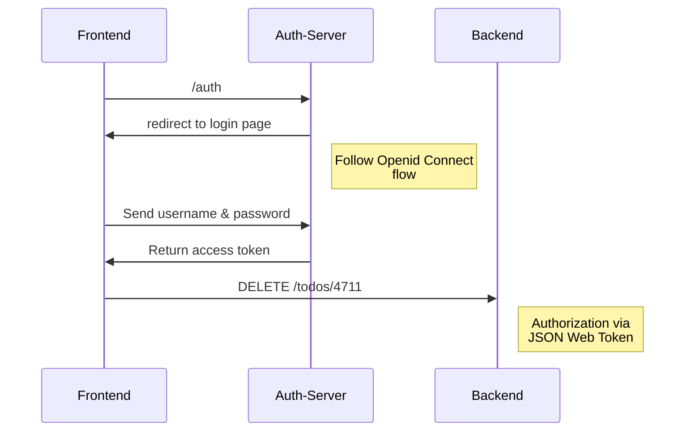

# Benutzerverwaltung

```mermaid
sequenceDiagram
    participant Frontend
    participant Auth-Server
    participant Backend
    Frontend->>Auth-Server: /auth
    Auth-Server->>Frontend: redirect to login page
    Note right of Auth-Server: Follow Openid Connect<br>flow
    Frontend->>Auth-Server: Send username & password
    Auth-Server->>Frontend: Return access token

    Frontend->>Backend: DELETE /todos/4711
    Note right of Backend: Authorization via <br>JSON Web Token
```