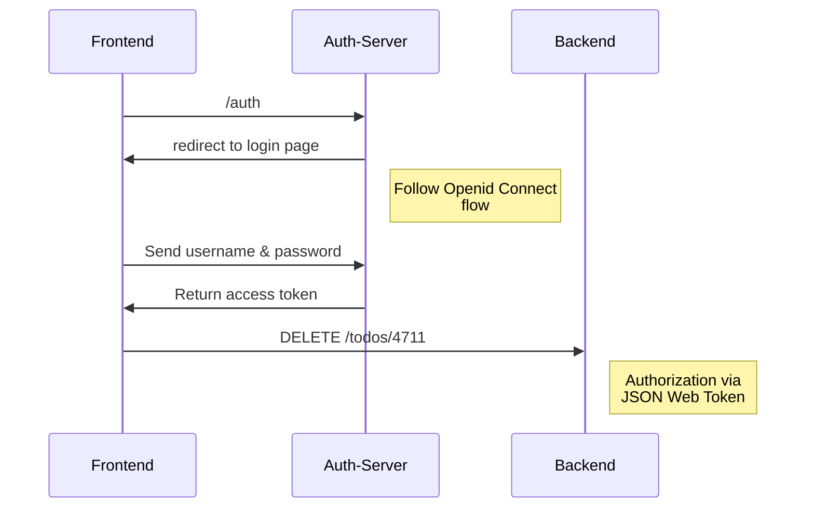

# Benutzerverwaltung

## Authentisierung und Autorisierung

In "klassischen" Webanwendungen erfolgt die Autorisierung einzelner Zugriffe in der Regel über eine *Session* auf dem Server: Nachdem der Benutzer sich angemeldet hat, 
wird ein *Session-Cookie* gesetzt und der Server merkt sich, zu welchem Benutzer die Session gehört.

Dieses Vorgehen hat Nachteile, wenn die Anwendung aus mehreren *Micro Services* besteht oder wenn man das Backend skalieren möchte.

Eine Alternative ist die Autorisierung einzelner Zugriffe über *JSON Web Token*. Mit so einem – von einem Authentication Server ausgestellten – Token weißt sich das 
Frontend gegenüber dem Backend aus.   

